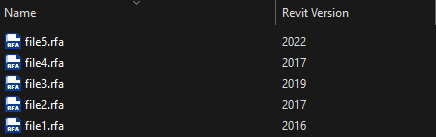

# RevitLauncher

A Revit launcher integrated in the windows context menu.

Automatically detect the Revit file version, support opening the file in the new process, or open in the current existing Revit process.

Supports ".rvt", ".rte", ".rft", ".rfa" 4 file extensions.

## Screenshots

### ConetxtMenu

- Locking Process

Click to switch to process who locking the file.

- Exist Process (Match/Mismatch version)

List all running revit processes. Click to opening the file in specified process.

- New Process

List all the revit versions installed on your computer. Click to starting a new Revit process and opening the file. 

### PropertyHandler

Show `RevitVersion` info with a windows explorer column.

## Third Party 

- [OpenMcdf](https://github.com/ironfede/openmcdf)

## Installation

Get the latest installer from the [Releases](https://github.com/Zhuangkh/RevitLauncher/releases) page.

This project uses [Microsoft Visual Studio Installer Projects](https://marketplace.visualstudio.com/items?itemName=VisualStudioClient.MicrosoftVisualStudio2017InstallerProjects) to generate the MSI package.

At the same time, with the help of [srm.exe](https://www.nuget.org/packages/ServerRegistrationManager) to complete the registration of shell extensions.

You may need to restart the *Explorer* process after completing the MSI installation to see the effect.

## License

[Apache 2.0 License](./LICENSE).
